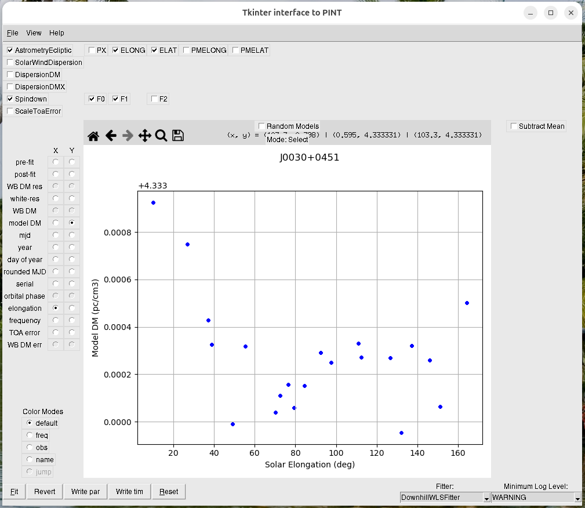

# SOP for SPNTA using Vela

## Preliminary sanity checks for data

1. Check if PINT can read the par and tim files.
    
    `$ pintk J0030+0451.DMX.par J0030+0451_all.tim`

   This should display the PINT GUI that looks like the tempo2 plk interface.

   

   I have seen that some of the InPTA tim files have key-only flags, like `-foo` instead of `-foo bar`. PINT requires all TOA flags to be key-value pairs. If you find flags like this change it to `-foo 1`.

   Upon reading PINT should automatically convert TCB -> TDB, and infer the underlying binary model if `BINARY T2` is encountered.

   If you find any issue at this step please let me know, it may be a PINT compatibility issue.

2. Look at the DM time series by clicking on the "model DM" radio button. Plot this against both "mjd" and "elongation". This will allow you to see the DM time series and decide if solar wind is important.
    
    

    

In this case there seems to be a solar wind effect, so it should be included in the timing model.

3. Make sure that you have the read and write permissions for all relevant files and folders.

## Deciding the DM/solar wind model

The default DM/SW model is DM + DM1 + DMGP. Decide whether to include solar wind based on the plots as mentioned above. If you see multiple solar wind peaks with varying heights, you should use a Taylor series of NE_SW with multiple terms (SWGP is not yet implemented, I am working on it!).

The following is an example where a solar wind Taylor series is required.

